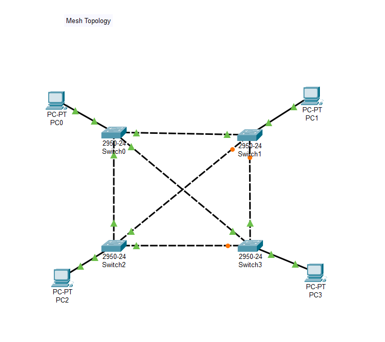

# 🌐 Cisco Packet Tracer – Network Topologies

## 📌 Overview

This repository showcases the implementation of **four fundamental network topologies** using **Cisco Packet Tracer**: **Mesh, Star, Bus, and Ring**.  

Each topology is simulated in its own `.pkt` file, allowing you to visualize device communication, data flow, and how network faults can affect performance.  

Cisco Packet Tracer is a popular simulation tool that lets students, educators, and networking enthusiasts **design, configure, and test networks virtually**, without the need for physical hardware.  
This project serves as a **hands-on reference** for understanding both theory and practical network behavior.

---

## 🌐 Topologies Implemented

### 🕸 Mesh Topology
- Every device connects to every other device.  
- ✅ Maximum redundancy & fault tolerance  
- ⚠️ High cabling cost & complexity  

---

### ⭐ Star Topology
- Devices connect to a central hub or switch.  
- ✅ Easy installation, configuration, and troubleshooting  
- ⚠️ Central hub failure affects the entire network  

---

### 🚌 Bus Topology
- All devices share a single backbone cable.  
- ✅ Simple setup, requires less cabling  
- ⚠️ A backbone fault can disrupt the entire network  

---

### 🔄 Ring Topology
- Devices form a closed loop, data travels in one direction.  
- ✅ Easy fault detection, simple structure  
- ⚠️ Breaks in the ring disrupt communication (unless dual rings are used)  

---

## ⚙️ Tools & Requirements
- **Cisco Packet Tracer** (v7.x or higher recommended)  
- Basic knowledge of **IP addressing, cabling, and device configuration**  

---

## 🚀 How to Use
1. Install Cisco Packet Tracer.  
2. Open any `.pkt` file from this repository.  
3. Assign IP addresses to devices (if not pre-configured).  
4. Test connectivity using **Ping** or simulation mode.  
5. Experiment with different configurations to explore network behavior.  

---

## 📖 Learning Outcomes
- Understand the structure and function of four major network topologies.  
- Practice building and testing networks virtually in Cisco Packet Tracer.  
- Compare pros and cons of each topology for real-world networking scenarios.  
